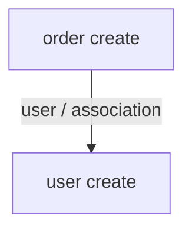

# factory_bot_graph_dynamic

`factory_bot_graph_dynamic` traces factory_bot execution and builds a graph of the
factories that were actually invoked.

It is useful when you want to inspect the runtime shape of a factory graph:
associations, nested factory calls from callbacks, traits, overrides, and the
objects produced by a specific test or setup block.

## Development status

This gem is under active development. APIs, output formats, and tracing behavior
may change significantly before a stable release.

The initial implementation uses a detailed runtime probe based on
`Module#prepend` against factory_bot internals. This gives more accurate parent
and association information than post-hoc notification events alone, while
keeping the public API small.

## Installation

Add the gem to your Gemfile:

```ruby
gem "factory_bot_graph_dynamic"
```

Then install it with Bundler:

```sh
bundle install
```

## Basic usage

Wrap the factory_bot calls you want to inspect in `FactoryBotGraphDynamic.trace`.
The block is executed normally, and the returned graph describes the factory
calls made inside that block.

```ruby
require "factory_bot_graph_dynamic"

graph = FactoryBotGraphDynamic.trace do
  FactoryBot.create(:order)
end

puts graph.to_mermaid
```

You can also pass an optional label. The label is included in the graph data and
can help you identify the trace when you save or compare output yourself.

```ruby
graph = FactoryBotGraphDynamic.trace("checkout order") do
  FactoryBot.create(:order)
end

puts graph.to_json
```

## Rendering output

Graphs can be rendered as Mermaid or JSON.

```ruby
puts graph.to_mermaid
puts graph.to_json
```

A small Mermaid graph looks like this:



The JSON output contains the graph label, nodes, and edges:

```ruby
json = graph.to_json
```

If you need to inspect or transform the graph in Ruby, use `graph.nodes` and
`graph.edges` directly.

```ruby
graph.nodes.each do |node|
  puts "#{node.factory} built with #{node.strategy}"
end

graph.edges.each do |edge|
  puts "#{edge.from} -> #{edge.to} via #{edge.source}"
end
```

## What is captured

Each factory invocation is recorded as a node. Nodes include:

- factory name
- build strategy
- traits
- overrides, when enabled
- factory build class, when available
- produced object class and object id
- caller location, when enabled
- start and finish timestamps

Edges are recorded between parent and child factory calls. Edges include:

- association edges, including the association name when available
- nested direct factory calls, such as calls made from factory callbacks
- strategy, traits, overrides, and caller location where available

## Configuration

Configure tracing globally with `FactoryBotGraphDynamic.configure`.

```ruby
FactoryBotGraphDynamic.configure do |config|
  config.capture_backtrace = false
  config.include_overrides = false
  config.max_depth = 2
end
```

Available settings:

- `capture_backtrace`: include the first non-gem caller location. Defaults to
  `true`.
- `include_overrides`: include factory override values on nodes and edges.
  Defaults to `true`.
- `max_depth`: limit how deep nested factory calls are captured. Defaults to
  `nil`, which captures all depths.

## Public API

The intended public API is small:

- `FactoryBotGraphDynamic.trace(label = nil, **options) { ... }`
- `FactoryBotGraphDynamic.configure { |config| ... }`
- `Graph#to_mermaid`
- `Graph#to_json`
- `graph.nodes`
- `graph.edges`

Output formats are still considered unstable while the gem is under active
development.

## Limitations

- The tracer patches factory_bot internals with `Module#prepend`.
- Tracing is scoped to the current thread while `trace` is running.
- The gem reports the factories that actually run; it does not statically analyze
  every factory definition in your project.
- Output structure and captured metadata may change before a stable release.

## Development

Install dependencies:

```sh
bundle install
```

Run the test suite:

```sh
bundle exec rspec
```
